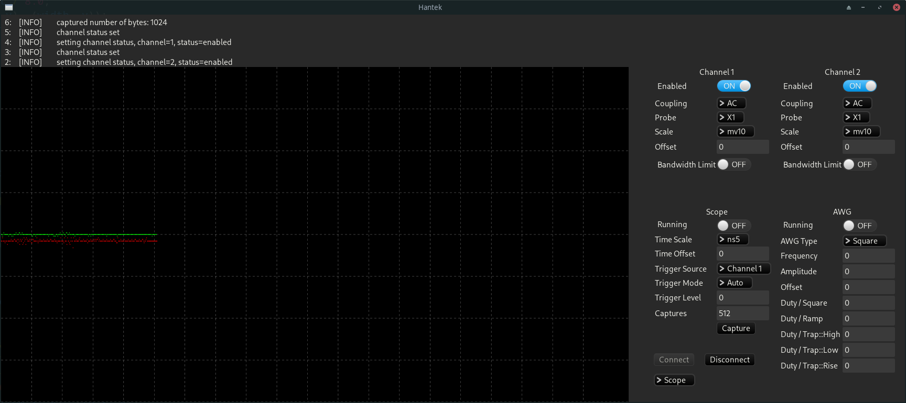

### Hanteker GUI

Hantek 2D42 (and possibly 2D72) handheld oscilloscope tool for Linux, Mac and Windows.

CLI Tool available at https://github.com/hkoosha/hanteker

### Progress

- Lib : https://github.com/hkoosha/hanteker
- CLI : https://github.com/hkoosha/hanteker
- GUI : https://github.com/hkoosha/hanteker_gui

### Disclaimer

I take no responsibility if this app breaks your oscilloscope! use at your own risk.

### Original Work

This is port of the C application to Rust, available at: https://github.com/lucaoli/Hantek.

## Screenshots

